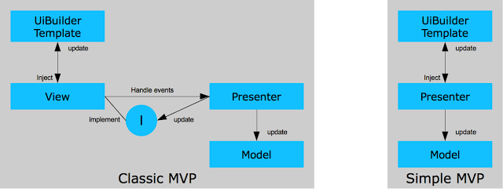

##[Google Web Toolkit (GWT) MVP Example](http://blog.hivedevelopment.co.uk/2009/08/google-web-toolkit-gwt-mvp-example.html) ([hellomvp2.tar](http://blog.jankowalski.pl/gwt-mvp-development-with-activities-and-places.html) | [Tutorial-Contacts.zip](http://code.google.com/p/google-web-toolkit/downloads/detail?name=Tutorial-Contacts.zip&can=2&q) | [example.gwt.gxt.test](https://github.com/TimReset/example.gwt.gxt.test)-[habrahabr.ru](http://habrahabr.ru/post/246285/))

* [blog.jankowalski.pl/gwt-mvp-development-with-activities-and-places](http://blog.jankowalski.pl/gwt-mvp-development-with-activities-and-places.html) >> [127.0.0.1:8888/index.html](http://127.0.0.1:8888/index.html)
* [Паттерны: MVC, MVP и MVVM](https://outcoldman.com/ru/archive/2010/02/22/паттерны-mvc-mvp-и-mvvm/)
* `Официальная документация`: [Building MVP apps: MVP Part I](http://www.gwtproject.org/articles/mvp-architecture.html)
* `Презентация`: [GWT-MVP-Framework](http://courses.coreservlets.com/Course-Materials/pdf/ajax/GWT-MVP-Framework.pdf) | [GWT-MVP-Intro](http://courses.coreservlets.com/Course-Materials/pdf/ajax/GWT-MVP-Intro.pdf)

> Google Web Toolkit (GWT) обеспечивает создание RIA (Rich Internet Application) Ajax-приложений на основе Java-кода.
>
> Достоинством GWT достигается в том что:
- он позволяет в класическом JAVA-стиле создавать клиентское веб-приложение И этим самым упрощает работу (веб-кодера) для (JAVA) разработчика;
- обеспечивает независимую совместимость и корректность/стабильность представления веб-страниц в кросс-браузерных и в кросс-платформенных средах;
>
> То что приложение является именно GWT-приложением определяется такими критериями как:
- (использованием) "GWT SDK";
- и GWT-модулем, именно этот GWT-модуль позволяет находить и компилировать приложение как GWT-приложение;
- (по умолчанию GWT-приложение использует сервер приложения 'Jetty')
>
> Приступая к работе над GWT-приложением нужно отметить что он имеет два ключевых этапа:
- `1.` Простое GWT-приложение (которое поддерживает представление только для одной ыеб-страницы);
- `2.` И много-страничное GWT-приложение (которое позволяет поддерживать постраничный переход - эмулирует виртуальную/псевдо много-страничность);
>
> Итак, знакомство с GWT можно организовать в следующем порядке:
- `1.1` создание примитивного GWT-проекта;
- `1.2` виджеты и примитивный способ подключения виджета на веб-страницу;
- `1.3` что такое GWT-сервис и реализация клиент-серверной архитектуры;
- `2.1` создание виджета (композитного элемента) для простого (одно-страничного) GWT-приложения;
- `2.2` создание много-страничного GWT-приложения (<виджет>+Activity+ActivityMapper, Place=страницы, URL-фрагммент=сессия, Presenter-контролер, MVP=(MVC));

1. `#1`:
2. `#2`:
3. `#3`:

* `Другие проекты`: [javacodegeeks.com/2012/02/gwt-mvp-made-simple](http://www.javacodegeeks.com/2012/02/gwt-mvp-made-simple.html)

##[ Google App Engine Java и Google Web Toolkit.pdf ]...........[ Введение ]...........[ страница #9 ]
> Google Web Toolkit (GWT) обеспечивает создание RIA (Rich Internet Application) Ajax-приложений на основе Java-кода.

##[ Google App Engine Java и Google Web Toolkit.pdf ]...........[ ГЛАВА 19 ]...........[ страница #321 ]
##Поддержка истории Web-браузера
> Для Ajax-приложений с **одной HTML-страницей**, содержимое которой изменяется есть проблема с использованием кнопок Web-браузера **Назад** и **Вперед**.
>
> Фреймворк в GWT предлагает решение этой проблемы с помощью класса **com.google.gwt.user.client.History**.

##[ Google App Engine Java и Google Web Toolkit.pdf ]...........[ ГЛАВА 20 ]...........[ страница #324 ]...........[`создан на основе механизма History-фреймворка - он оперирует объектами Place и Activity`]
## Фреймворк *Activities* and *Places* (`обеспечивает добавление URL-фрагментов к адресной строке для веб-страниц GWT-приложения; связывая их с историей Web-браузера`)
> Объект **Place** представляет состояние веб-страницу(ы) для GWT-приложения **(** *и может быть конвертирован в URL-фрагмент адреса GWT-приложения* **)**.
>
> Веб-страницы GWT-приложения связываются между собой URL-фрагментами с помощью **Tokenizer** **(** *com.google.gwt.place.shared.PlaceTokenizer* **)**.
>
> Синхронизируется URL-фрагмент с веб-страницей с помощью **com.google.gwt.place.shared.PlaceHistoryMapper** **(** *маркируется аннотацией @WithTokenizers - для авто-реализации при вызове GWT.create(Class)* **)**.
>
> Представление GUI-интерфейса для веб-страницы GWT-приложения создается с помощью составного компонента **Widget**.
>
> **Activity** **(** *com.google.gwt.activity.shared.AbstractActivity* **)** отвечает за **:** *Загрузку GUI-интерфейса веб-страницы GWT-приложения* **;** *Отображение сообщений пользователю при переходе на другую веб-страницу* **;** *При закрытии окна Web-браузера* **;**
>
> Связать веб-страницы GWT-приложения с **Activity** можно с помощью **com.google.gwt.activity.shared.ActivityMapper** **(** *с определением его метода Activity getActivity(place)* **)**

##gwt-tutorial-ru.pdf ...... Асинхронный вызовы ...... Создайте прокси сервисного класса ...... Создайте callback ...... страница #29-30
* `gwt-tutorial-ru.pdf`: [drive.google.com/file/d/0B418nT5Bo9w_engtSTdpVDllY2s](https://drive.google.com/file/d/0B418nT5Bo9w_engtSTdpVDllY2s/view) **(** *[github.com/Home-GWT/docs/blob/master/gwt-tutorial-ru.pdf](https://github.com/Home-GWT/docs/blob/master/gwt-tutorial-ru.pdf)* **)**

##[Google App Engine Java и Google Web Toolkit.pdf - страница 10](http://)
> Регистрация приложения в App Engine осуществляется с помощью Web-страницы консоли администратора по адресу [https://appengine.google.com/](https://appengine.google.com/), при этом на один аккаунт разработчика можно зарегистрировать до 10 приложений. 
>
> В процессе регистрации для приложения создается поддомен домена appspot.com и формируется URL-адрес доступа к приложению в виде http://[идентификатор приложения].appspot.com/. После регистрации приложение можно привязать к домену, зарегистрированному в бизнес-приложении Google Apps ([http://www.google.com/apps/intl/ru/business/](http://www.google.com/apps/intl/ru/business/)). 
>
> Само добавление приложения в App Engine после его регистрации осуществляется с помощью инструментов разработки GAE-приложений.
>
>Для разработки приложений GAE-платформа предоставляет наборы Google App Engine SDK для Java, Python и Go, обеспечивающие эмуляцию соответствующих сред выполнения, работу GAE-служб и инструменты загрузки приложений в GAE-платформу.
>
